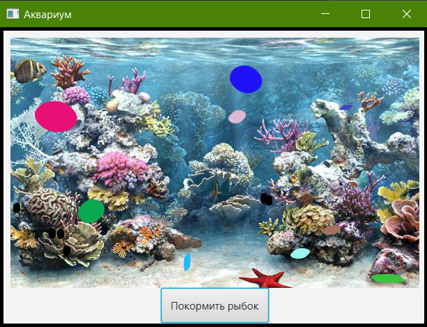
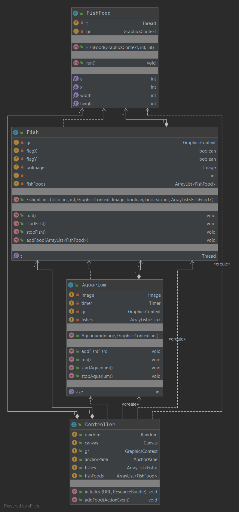

# Аквариум

Приложение моделирует аквариум с рыбками и их питание.

## Назначение программного продукта
Программный продукт предназначен для изучения паттерна Producer/Consumer целевой аудиторией-студентами.

## Область применения программного продукта
Учебные заведения. 

## Техническое описание программы
Программный продукт представляет из себя моделирование взаимодействия производителя (корм) и потребителя (рыбки).

## Применяемые программные средства
Программа разработана в IntelliJ IDEA на платформе JavaFX с использованием языка Java. Сборка осуществлена с помощью Gradle.

### Диаграмма классов

